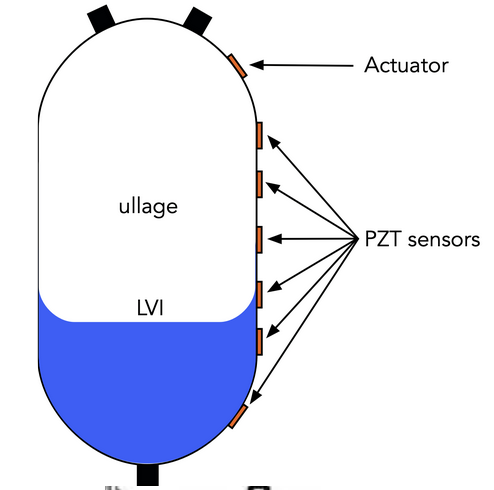

# Microgravity Ullage Detection (MUD)

## About
MUD is an experiment established in 2022 as part of Carthage College's microgravity program. When MUD was created, its goal was to develop a solution to a long-term issue in space travel: refueling spacecraft in microgravity.

MUD's goal is to find the ullage location and size. On Earth, the ullage, which is the pocket of gas in a closed container of fluid, sits at the top. In microgravity, the ullage sits in the middle of a tank, and the liquid is evenly distributed to the walls of the tank.
<div style="display: flex; gap: 24px; align-items: flex-start;">
    <div>
        
        <p style="text-align: center;"><strong>Ullage in 1G (Earth gravity)</strong></p>
    </div>
    <div>
        
        <p style="text-align: center;"><strong>Ullage in Microgravity</strong></p>
    </div>
</div>

During fuel transfer, ullage transfer with fuel can cause numerous problems. Our sister project, microgravity ullage trapping, works to move ullage. MUD uses five PZT patches, including an actuator, which produces white noise, allowing us to track the ullage location and the location of liquid propellant in the tank.

MUD drains water (or a liquid propellant simulant) from a metal tank, equipped with PZT patches, into a transparent polycarbonate tank. This setup allows data to be recorded during the transfer, as the amount of simulant in the metal tank decreases and the ullage increases, simulating a real fuel transfer. A pump moves the fluid from Tank A (metal) to Tank B (polycarbonate), while a solenoid regulates the pressure between the two tanks.

The raw sensor voltage generated by the white noise from the PZT patches is picked up by the actuator and stored on a Raspberry Pi. Once the data is retrieved, it's processed using a root mean square (RMS) script to be viewed and interpreted by the user.

## Content

- `MUD.c` can be used to control the MUD experiment interactively through the command-line. It has a TUI.
- `MUD_BlueOrigin_Code.c` can be used to automate the MUD experiment for rocket launch. It is tailor-made for the Blue Origin New Shepard flight profile.
- `MUD_BlueOrigin_Code_test.c` is used to test half-baked code, and it is not guaranteed to be stable.
- `MUD_BlueOrigin_Code.bak.c` is a fully functional and stable backup of MUD_BlueOrigin_Code`.c

## Prerequisites
- Raspberry Pi OS
- Raspberry Pi with 40-pin GPIO header

## Dependencies
This code utilizes the following dependencies:

- [WiringPi](https://github.com/WiringPi/WiringPi.git)

- [daqhats](https://github.com/mccdaq/daqhats.git)

Please refer to the above URLs for more information about each dependency.

The experiment hardware is managed by a Raspberry Pi 3B, which interfaces with all components of MUD. You can operate the experiment using either `MUD.c` or `MUD_BlueOrigin_Code.c`:

- `MUD.c` offers a text-based user interface (TUI) for manual control and monitoring of the experiment.
- `MUD_BlueOrigin_Code.c` provides automated control specifically designed for the Blue Origin New Shepard flight profile, enabling hands-off operation during launch and flight.

Choose the appropriate program based on your experimental scenario and required level of automation.

## How to Operate
Both programs (`MUD.c` and `MUD_BlueOrigin_Code.c`) should be placed within the same folder for the experiment, and both code can be compiled and build by the attached CMake file. The operation procedures differ between `MUD.c` and `MUD_BlueOrigin_Code.c`:

- **`MUD.c`**:  
 Designed for manual control via a text-based user interface (TUI).  
 Launch the program in a terminal to interactively monitor and control the experiment.  
 Follow on-screen prompts to execute commands and view experiment status.

- **`MUD_BlueOrigin_Code.c`**:  
 Intended for automated operation during the Blue Origin New Shepard flight.  
 Run the program to initiate automated data collection and experiment control according to the flight profile.  
 Minimal user interaction is required; the program will log events and manage hardware based on mission timing.

Refer to the sections below for details on TUI usage, command-line options, and experiment scenarios.

# `MUD.c`

### TUI
The image below shows the TUI of `MUD.c`, which provides interactive control and monitoring of the experiment.

| Row | Explanation  |
|-----------------|-----------------|
|   2   |The second row displays a selection of commands that can be entered in the third row. **Note:** This is not an exhaustive list of all available commands.|
|   3   |Command input field|
|   4   |Displays the status of the piezo patch actuator, indicating whether it is active or inactive.|
|   5   |Indicates whether the experiment is actively transferring liquid from Tank A to Tank B, showing the current status of the transfer process.|
|   6   |Displays the status of liquid transfer from Tank B to Tank A, showing whether the reverse transfer process is active or inactive.|
|   7   |Displays the status of data collection, indicating whether the experiment is actively recording data or not.|
|   8   |Shows the real-time pressure reading from the flow loop. This value is continuously updated only while data collection is active.|
|   9   |Displays the current PWM pump speed. The default is 100%, but it can be adjusted using the `speed` command.|
|   10  |Shows the number of active MCC DAQHAT devices. These DAQHATs are used to monitor the piezo patch actuators (PZT), flow sensor, and pressure transducer. This number can be changed through the `count` command. However, reducing this number will limit the monitoring capabilities of the MUD experiment.|
|   11  |flight mode|

### Command
| Command | Explanation  |
|-----------------|-----------------|
|   atob   |Initiates and pauses liquid transfer from Tank A to Tank B. Use this command to start or stop the flow in this direction.|
|   btoa   |Initiates and pauses liquid transfer from Tank B to Tank A. Use this command to control flow in the reverse direction.|
|   act    |Toggles the piezo patch actuator on or off, allowing manual control of actuator status.|
|   data   |Starts or stops data collection, enabling you to manually begin or end experiment data logging.|
|   s1   |Toggle opens and closes solenoid valve 1 (S1). S1 is a normally closed valve. It can also be manually opened by short-circuiting the relay board labeled `S1`.|
|   s2   |Toggle opens and closes solenoid valve 2 (S2). S2 is a normally closed valve. It can also be manually opened by short-circuiting the relay board labeled `S2`.|
|   s3   |Toggle opens and closes solenoid valve 3. S3 is used for pressure equalization between Tank A and Tank B. S3 is a normally closed valve. It can also be manually opened by short-circuiting the relay board labeled `S3`. **Note:** S3 should be opened whenever either the `atob` or `btoa` liquid transfer commands are initiated to ensure proper pressure equalization during the transfer process.|
|   file  |Displays the current output data directory, indicating where experiment logs and data files are saved. Use this command to verify or locate the storage path for collected data.|
|   cam   |Toggles the camera power on or off, allowing manual control of the camera during the experiment. Use this command to start or stop video recording as needed.|
|   speed  |Sets the PWM pump speed. After entering the `speed` command, the TUI shifts to the device count input field. Enter a value between 0 and 100 to adjust the pump speed as needed for your experiment.|
|   count  |Configures the number of active MCC DAQHAT devices. After entering the `count` command, the TUI shifts to the device count input field. Enter 1 or 2 to specify how many DAQHATs will be used for experiment monitoring and control. Lowering the count reduces available sensor channels and monitoring capability. If set to 1, only the DAQHAT closest to the Raspberry Pi 3B will be active.|
<!-- speed"enter the pump speed you want 0-100:"
channels
count"Enter Device Count\n" -->

### Flow of manual data collection
1. Power MUD with 27V. When power is supplied to MUD, the Raspberry Pi automatically starts.
2. Change directory to `~/MUD_Code/`.
3. Run `./mud`.
4. Open S3 valve using `s3` command.
5. Start data collection using the `data` command.
6. Transfer liquid using the `atob` command, and wait until tank A gets empty.
7. Stop A to B transfer using the `atob` command again.
8. Stop data collection using the `data` command again.
9. Transfer liquid using the `btoa` command, and wait until tank B gets empty.
10. Stop B to A transfer using the `btoa` command again.
11. Exit `mud` application using `q` command. (S3 valve will close automatically)
12. Check data in `MUD_Code/data` directory.
13. Shutdown Raspberry Pi as needed.

## Troubleshooting
- When the `mud` application starts, get MCC DAWHATs initialization error.
    - Exit application using `q` and launch `mud` again. It is caused by the fact that MCC DAQ HATs are not closed correctly.
- If you initiate `btoa` while `atob` is active (or vice versa), only the last command can be used to stop the transfer.
    - For example, if you start `atob` and then initiate `btoa`, you must use the `btoa` command again to stop the transfer; using `atob` will not stop the process.
- Pressure reading in TUI stays 0.0 PSIG.
    - It will only be updated while the `data` command is running.
- Can not or forgot to open the S3 valve.
    - Use `s3` command or short relay switch labeled `S3` as soon as possible.
- Heard audible noise in white noise.
    - It is caused by Raspberry Pi Wi-Fi and Bluetooth signals. Turn them off using the following commands.
    ```
    sudo rfkill block 0    # disables Wi-Fi
    sudo rfkill block 1    # disables Bluetooth
    ```

# `MUD_BlueOrigin_Code.c`
### New Shepard flight
The following table is a flight profile of events, and Mission Elapsed Time colored in <span style="color: red;">RED</span> are events that MUD monitors or actions linked to the event.

| Mission Elapsed Time (MET) (seconds) | New Shepard EVENT  | MUD EVENT  |
|-----------------|-----------------|-----------------|
| <span style="color: red;">-300</span>    | Payload Power and Data On    |   MUD turns ON and starts recording data(Controller, pressure transducer, flow sensor, LED, white noise generator/amplifier, and actuator turn on). Solenoid valve 3 equilizes the pressure of Tanks A and B as needed. When the controller booted, `crontab` run `mud_blue.202x` |
| 0     | Main Engine Ignition Command  |
| 8     | Liftoff  |
| 128   | Max g on Ascent  |
| 141   | MECO (Main Engine Cut Off)   |
| <span style="color: red;">163</span>   | Separate Crew Capsule, fire RCS to stabilize Crew Capsule   |   Controller expect digital signal indicate Crew Capsule separation. When it receives a signal, the controller counts 30 seconds and logs `"CC + 30"`, which is about MET+193. 30 30-second wait time exists to let liquid in the tank settle down for clean and high-resolution data from an equilibrated liquid.    |
| <span style="color: red;">181</span>   | Coast Start Detected RCS stabilization firings complete, Sensed Acceleration < 0.01 g   |    Count an additional 15 seconds from `"CC+30"` and start periodical equilization. 1.5 seconds later, the controller logs `"Equalization Start"`, and the pump turns on to move liquid from Tank A to Tank B for 120 seconds. Count 1.5 seconds, stop periodical equilization, and log `"Equalization End" `. A 1.5-second gap between the beginning and end of periodic equalization and pump is to avoid an increase in start-up impedance happening at the same time.   |
| 245   | Apogee  |
| <span style="color: red;">332</span>   | Sensed Acceleration  > 0.01 g  |   Experiment expected to end at MET+328, and log `"Experiment Off"` and begin shutdown process. During the shutdown process, cameras will repeat turning on and off a few times, and log `"Quitting Program"`. This is part of the video saving process. Once the shutdown process ends, log `"Program ended safely"` and the controller shuts down. Flow sensor and LED remain turned on.   |
| 346   | Coast End Detected Sensed Acceleration  > 0.1 g  |
| 364   | Sensed Acceleration  > 1.0 g  |
| 381   | Max g on Reentry  |
| 496   | Deploy Drogues  |
| 508   | Deploy Mains   |
| 622   | Initiate Terminal Decelerator  |
| <span style="color: red;">922</span>   | Payload Power Off, Mission End   |   Flow sensor and LED turn off as Crew Capsule power off.   |


For questions regarding the New Shepard flight profile, please refer to [Blue Origin's payload information](https://www.blueorigin.com/new-shepard/payloads).

## Expected output in log
| Expected output timing in MET | Expected Log output  |   Reason and Usage   |
|-----------------|-----------------|-----------------|
|   0~30   |   <ul><li>`"mcc118 #%i is open"`</li><li>`"mcc118 #%i scan stopped"`</li><li>`"mcc118 #%i scan buffer cleaned"`</li><li>`"mcc118 #%i closed"`</li></ul>   |    These messages appear when MCC DAQHATs are active when `mud_blue.202x` launch. It likely happens when MUD experiences sudden power loss or cannot perform the prescribed shutdown process. These messages can be used as an indicator of unstable power from the vehicle or external power supply.  `mud_blue.202x` performs MCC initilization when it launches, so these messages do not affect the MUD data collection process.    |
|   "   |   <ul><li>`"Log Started"`</li><li>`"GPIO initialized"`</li><li>`"Kernel Log Started"`</li><li>`"camera turned on"`</li><li>`"act turned on"`</li><li>`"Data Collection Started"`</li></ul>   |    These message indicates which and when individual component of MUD turned on.   |
|   163~165 |   <ul><li>`"CC"`</li><li>`"Experiment on"`</li></ul>   |  These messages appear when WiringPi Pin 24/BCM GPIO 5/Physical Pin 18 detects `HIGH`, and these can be used to debug payload integration. |
|   193~195    |   <ul>`"CC + 30"` |  This message indicates that liquid in Tank A is expected to be in an equilibrium state.   |
|   207~212    |   <ul><li>`"Equalization Start"`</li><li>`"A to B on"`</li></ul>  |    These messages should appear 15 and 16.5 seconds after the `"CC + 30"` message.   |
|   327~332 |   <ul><li>`"A to B off"`</li><li>`"Equalization End"`</li></ul>   |    These messages should appear 120 and 120.5 seconds after the `"A to B on"` message.   |
|   357~360    |   <ul>`"Experiment Off"` |   This message indicates 30 seconds passed from the last message.   |
|   375~380    |   <ul>`"Quitting Program"` |   This message appears when `quitting_program` flag is set. Data collection will begin to wrap up buffered data, clean up heap-allocated memories, and close MCC DAQHATs.   |
|   "   |   <ul>`"Program ended safely"` |   This is and should be **the last message** in the log file. This message indicates all buffers, heaps, and resources are cleaned up, leaving no remains.    |

## Flow of auto data collection
There are two ways to run `mud_blue.202x`: headless or with a monitor.

### Headless
This method is used for actual rocket launches.
1. Power MUD with 27V. When power is supplied to MUD, the Raspberry Pi automatically starts.
2. Add or uncomment the following line to your `crontab` to run `mud_blue.202x` at boot (make sure the file is executable and use the full path):
 ```
 @reboot /home/pi/MUD_Code/mud_blue.202x
 ```
3. Reboot
    - `mud_blue.202x` will start automatically
4. Wait 1 minute to make sure `mud_blue.202x` is waiting for `CC` flag digital signal.
5. Apply 5V to the white wire labeled `com` and `com ⏚`.
6. Wait until the white noise from the actuator stops.
7. Wait another 1 minute for the Raspberry Pi to shut down safely.
8. Turn off and on the power supply to boot Raspberry Pi.
9. `mud_blue.202x` started again, so comment out `crontab` line and reboot.
10. Check data in `MUD_Code/Blue-Data/` directory.
11. Shutdown or reboot Raspberry Pi as needed.

#### Flow of operation for actual rocket launch
1. Power MUD with 27V. When power is supplied to MUD, the Raspberry Pi automatically starts.
2. Check data in `MUD_Code/Blue-Data/` and `MUD_Code/data/` directory to make sure ground MUD data will not be mixed with microgravity MUD data.
3. Add or uncomment the following line to your `crontab` to run `mud_blue.202x` at boot (make sure the file is executable and use the full path):
 ```
 @reboot /home/pi/MUD_Code/mud_blue.202x
 ```
4. Now it's ready for flight.
---
5. MUD came back from the flight.
6. Power MUD with 27V. When power is supplied to MUD, the Raspberry Pi automatically starts `mud_blue.202x`.
7. `mud_blue.202x` started again, so comment out `crontab` line and reboot.
8. Check data in `MUD_Code/Blue-Data/` directory.
9. Shutdown or reboot Raspberry Pi as needed.

### With monitor
This method can be used to observe the experiment in real time, monitor log outputs, and manually intervene if necessary during ground tests or development. It is recommended for debugging, validation, and training purposes before deploying the system in a headless flight scenario.

1. Power MUD with 27V. When power is supplied to MUD, the Raspberry Pi automatically starts.
2. Change directory to `~/MUD_Code/`.
3. Run `mud_blue.202x`.
4. Optional: comment out `crontab` line to skip step 10.
5. Wait 1 minute to make sure `mud_blue.202x` is waiting for `CC` flag digital signal.
6. Apply 5V to the white wire labeled `com` and `com ⏚`
7. Wait until the white noise from the actuator stops.
8. Wait another 1 minute for the Raspberry Pi to shut down safely.
9. Turn off and on the power supply to boot Raspberry Pi.
10.  **Skip this if you did step 4**. `mud_blue.202x` started again, so comment out `crontab` line and reboot
12. Check data in `MUD_Code/Blue-Data/` directory.
13. Shutdown or reboot Raspberry Pi as needed.

## Troubleshooting
- When the `mud_blue.202x` application starts, get MCC DAQHATs initialization error.
    - The application will attempt to automatically initialize MCC DAQHATs and start the normal procedure.
- MUD draws too much current.
    - MUD puts the highest load when the solenoid valve and pump start and end. Startup impedance causes high current draw.
    - Change the start and end timing of the solenoid valve and pump.
- Heard audible noise in white noise.
    - It is caused by Raspberry Pi Wi-Fi and Bluetooth signals. Turn them off using the following commands.
    ```
    sudo rfkill block 0    # disables Wi-Fi
    sudo rfkill block 1    # disables Bluetooth
    ```